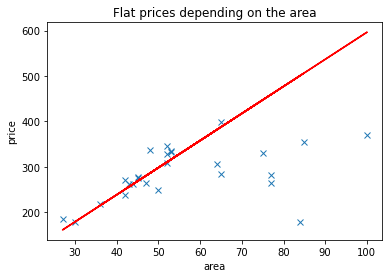
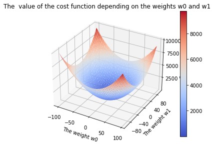
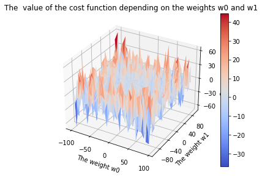
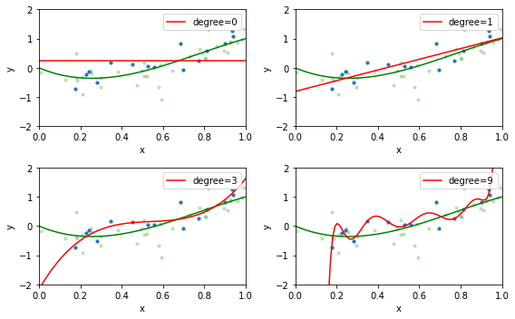
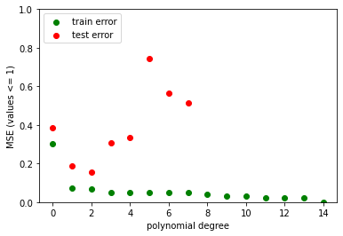
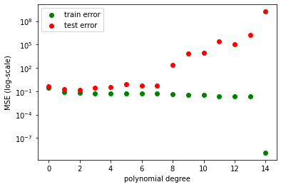

# Linear regression
The followning code presents a template for implementing linear regression for a single variable.


```python
import matplotlib
import numpy as np
import matplotlib.pyplot as plt
from sklearn.datasets import make_regression # for new sklearn version
%matplotlib inline
```


```python
sizes = np.loadtxt('data/flat.areas').reshape((26,1)) #load the vector of flat areas
prices = np.loadtxt('data/flat.prices').reshape((26,1)) #load the vector of flat prices
samples_cnt = len(prices) #count the number of examples
```

## Task 1

Complete the following `predict` function so that, given a list of features and the weights in linear regression. Assume that `weight1` represents the slope, whereas `weight0` is the intercept.


```python
def predict(features, weight0, weight1):
    predicted = []
    for i in features:
        predicted.append(weight0 + (weight1 * i))
    return predicted
```

Let's test it!


```python
feature = [1, 2, 3]
expected = [10, 20, 30]
predicted = predict(np.array(feature), 0, 10)

assert (np.array(predicted) == np.array(expected)).all()
```


```python
feature = [1, 2, 3]
expected = [11, 12, 13]
predicted = predict(np.array(feature), 10, 1)

assert (np.array(predicted) == np.array(expected)).all()
```

## Task 2

Complete the following cell of code so it iteratively improves the weights of the model to find the best line mapping `sizes` to `prices`. Use the gradient descent algorithm presented during the lecture.


```python
weight0 = 0.0
weight1 = 0.0
learning_rate = 0.0001
maxIteration = 10000 # number of iterations
n=len(sizes)
for i in range(maxIteration): 
    predicted = sum(predict(sizes, weight0, weight1))
    cost = 0
    for j in range(n):
        cost += np.sum((prices[j]-(weight0 + (weight1 * sizes[j])))**2) / len(prices[j])
        grad1 = -(2/n) * (sizes[j] * (prices[j]-(weight0 + (weight1 * sizes[j]))))
        grad0 = -(2/n) * (prices[j]-(weight0 + (weight1 * sizes[j])))
    weight0 -= (learning_rate*grad0)
    weight1 -= (learning_rate*grad1)
        
        
    ...
```


```python
predicted_prices = predict(sizes, weight0, weight1)

plt.plot(sizes, prices, "x")
plt.plot(sizes, predicted_prices, "r-")
plt.title('Flat prices depending on the area')
plt.xlabel('area')
plt.ylabel('price')
plt.show()
print("Computed weights -> w0:", weight0, "w1:", weight1)
```


    

    


    Computed weights -> w0: [0.19866815] w1: [5.9600444]
    

## Task 3

The following piece of code draws charts of two different cost functions. The first chart presents mean squared error, the second one some arbitrary function.


```python
from mpl_toolkits.mplot3d import Axes3D
from matplotlib import cm
from matplotlib.ticker import MaxNLocator
from matplotlib.ticker import LinearLocator, FormatStrFormatter

def visualize_cost_function(sizes_transformed, prices_transformed, w0_values, w1_values, loss_function):
	points = []
	for i in w0_values:
	    for j in w1_values:
	        points.append([i, j, loss_function(sizes_transformed, prices_transformed, i,j)])
	points = np.array(points)

	Xs = points[:,0]
	Ys = points[:,1]
	Zs = points[:,2]

	fig = plt.figure()


	ax = fig.add_subplot(111, projection='3d')
	surf = ax.plot_trisurf(Xs, Ys, Zs, cmap=plt.cm.coolwarm, linewidth=0)

	# 'The left and right margins cannot be made large' tight_layout fix
	for spine in ax.spines.values():
	    spine.set_visible(False)

	fig.colorbar(surf)
	ax.xaxis.set_major_locator(MaxNLocator(5))
	ax.yaxis.set_major_locator(MaxNLocator(6))
	ax.zaxis.set_major_locator(MaxNLocator(5))
	ax.set_title('The  value of the cost function depending on the weights w0 and w1')
	ax.set_zlabel('Cost function')
	ax.set_xlabel('The weight w0')
	ax.set_ylabel('The weight w1')
	fig.tight_layout()

	plt.show()     

def loss_function(sizes, prices, weight0, weight1):
    predictions = [weight0 + weight1*sizes[i] for i in range(len(prices))]
    return sum([(predictions[i] - prices[i])**2 for i in range(len(prices))])/(2*len(prices))


def loss_function2(sizes, prices, weight0, weight1):
    predictions = [weight0 + weight1*sizes[i] for i in range(len(prices))]
    return sum([(np.sin(predictions[i]/prices[i]**2) * (predictions[i]*prices[i]**3)) for i in range(len(prices))])/(2*len(prices))


w0_values = np.arange(-10, 10, 0.5)
w1_values = np.arange(-10, 10, 0.5)

sizes_transformed = ((sizes - np.mean(sizes)) / np.std(sizes)).reshape(-1)
prices_transformed = ((prices - np.mean(prices)) / np.std(prices)).reshape(-1)

w0_values = np.arange(-100, 100, 5)
w1_values = np.arange(-100, 100, 5)

visualize_cost_function(sizes_transformed, prices_transformed, w0_values, w1_values, loss_function)
visualize_cost_function(sizes_transformed, prices_transformed, w0_values, w1_values, loss_function2)
```


    

    


    

    


### Why the first one is preferred over the second one for learning with the gradient descent?

**because it creates a smoother landscape which makes finding the minimum much easier (harder to get stuck in a local min)**

### What makes a good cost function?

**a good cost function is mean squared error which measures the difference between the original set and the predicted value**

## Polynomial regression

The following piece of code draws the results of learning polynomial regression models with varying polynomial degree for the same data.


```python
import numpy as np
from sklearn.linear_model import LinearRegression
from sklearn.linear_model import Ridge
from sklearn.model_selection import train_test_split
from sklearn.preprocessing import PolynomialFeatures
from sklearn.pipeline import make_pipeline
from sklearn.metrics import mean_squared_error

# the ground truth - this is real function we'd like to uncover using polynomial regression. In a real situation this function is unknown.
def f(x): 
	return -(3*x)+(7*x**2)-(3*x**3)


X = np.random.uniform(0, 1, size=50)[:, np.newaxis] #sample 50 points from 0 to 1
y = f(X) + np.random.normal(scale=0.3, size=50)[:, np.newaxis] #generate labels for the randomly sampled points adding some Gaussian noise

X_train, X_test, y_train, y_test = train_test_split(X, y, test_size=0.7) # split the data into a train and test subsets


# an auxiliary function to draw plots
def plot_approximation(est, ax, label=None):
    x = np.linspace(0,1,100) 
    ax.plot(x, f(x), color='green')
    ax.scatter(X_train, y_train, s=10)
    ax.scatter(X_test, y_test, s=10, color='green', alpha=0.2)
    ax.plot(x, est.predict(x[:, np.newaxis]), color='red', label=label)
    ax.set_ylim((-2, 2))
    ax.set_xlim((0, 1))
    ax.set_ylabel('y')
    ax.set_xlabel('x')
    ax.legend(loc='upper right')

# Use scikit-learn to generate polynomial regression models to draw detailed charts
fig, axes = plt.subplots(2, 2, figsize=(8, 5))
for ax, degree in zip(axes.ravel(), [0, 1, 3, 9]):
    est = make_pipeline(PolynomialFeatures(degree), LinearRegression())
    #est = make_pipeline(PolynomialFeatures(degree), Ridge())
    est.fit(X_train, y_train)
    plot_approximation(est, ax, label='degree=%d' % degree)
plt.tight_layout()
plt.show()
```


    

    


```python
# Use scikit-learn to generate polynomial regression models to draw a summary chart
train_error = np.empty(15)
test_error = np.empty(15)
for degree in range(15):
    est = make_pipeline(PolynomialFeatures(degree), LinearRegression())
    #est = make_pipeline(PolynomialFeatures(degree), Ridge())
    est.fit(X_train, y_train)
    train_error[degree] = mean_squared_error(y_train, est.predict(X_train))
    test_error[degree] = mean_squared_error(y_test, est.predict(X_test))
    
    

plt.scatter(np.arange(15), train_error, color='green', label='train error')
plt.scatter(np.arange(15), test_error, color='red', label='test error')
plt.ylim((0.0, 1e0))
plt.ylabel('MSE (values <= 1)')
plt.xlabel('polynomial degree')
plt.legend(loc = 'upper left')
plt.show()

plt.scatter(np.arange(15), train_error, color='green', label='train error')
plt.scatter(np.arange(15), test_error, color='red', label='test error')
plt.yscale('log')
plt.ylabel('MSE (log-scale)')
plt.xlabel('polynomial degree')
plt.legend(loc = 'upper left')
plt.show()
```


    

    


    

    


## Task 4

For high enough degrees of the polynomial, the error on the test set increases. Why is that?

**As the degree increases, the prediction is predicting more and more similar outcomes as the ones in the train set. Which is good to some extent. Coz with time they are going to be too similar to the train set and as an outcome for a test set the predictions can be not so similar to the goal ones.**

What is the purpose of using the test set?

**The purpose is to check whether we learned to find a way to predict similar outcomes to the expected ones with minimal cost and did not create a very complicated polynomial that would predict exact outcomes for the train set**

## Task 5

Replace `LinearRegression` with `Ridge` and see how does using ridge regularization influences the error on the test set.
Observe the difference in the generated curves. Describe it, explain the reasons for it and comment whether the change is positive or negative.

**by looking at the Ridge graphs, its easie to estimate the optimal degree of the polynomial for which the train set has good outcomes and we can see that then the outcomes for test set are also good, which cannot be used in the LinearRegression ones (the possible outcomes for LinearRegression test set get very random as the degree grows)**


```python

```
